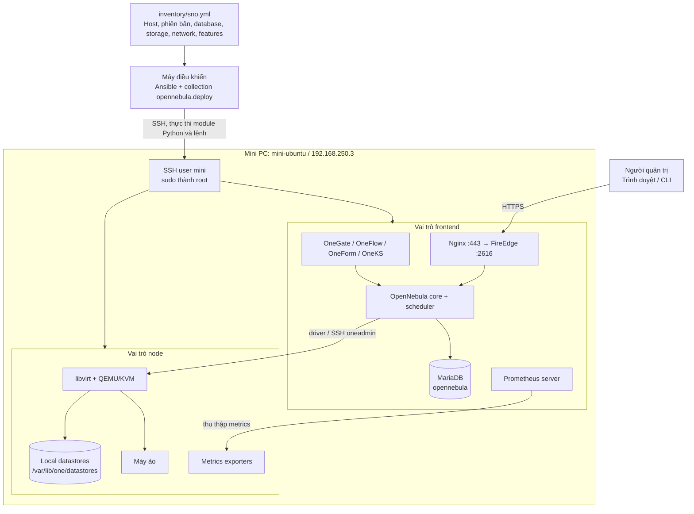
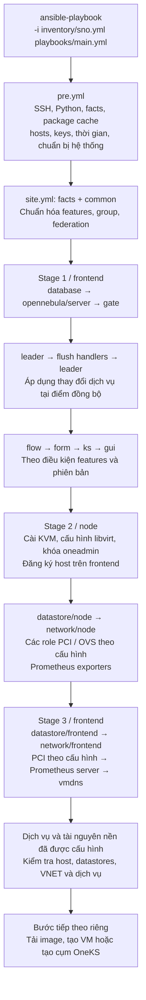
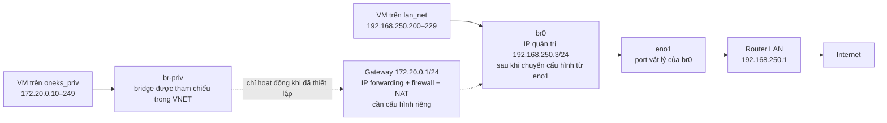
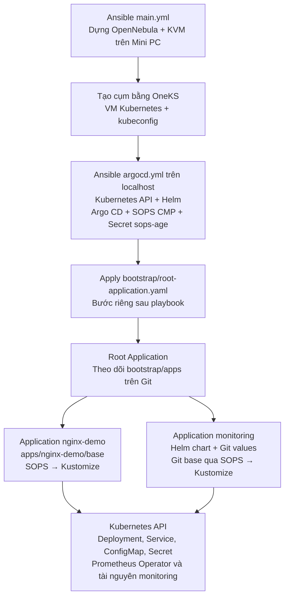
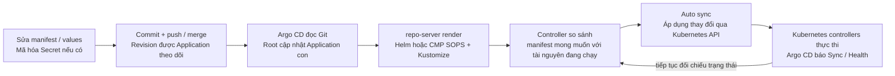

# SNO hoạt động như thế nào khi triển khai bằng Ansible?

Trong repo này, **SNO là Single Node OpenNebula**: một máy Ubuntu chạy cả OpenNebula Frontend và KVM Node. Ansible chạy trên máy điều khiển, kết nối SSH đến Ubuntu để cài đặt và cấu hình. Khi triển khai xong, các dịch vụ trên Ubuntu tự vận hành cloud; không cần giữ Ansible chạy.

Tài liệu đối chiếu với mã nguồn tại commit `3c0541d`, ngày 11/09/2026, và [inventory SNO](../inventory/sno.yml). Đây là mô tả cấu hình và hành vi của code, không phải biên bản kiểm tra trạng thái máy thật. Các bước chuẩn bị máy có trong [hướng dẫn cài đặt](../INSTALL-SNO.md).

Phần 1–8 giải thích hạ tầng SNO. [Phần 9](#9-gitops-từ-sno-đến-ứng-dụng-trong-kubernetes) nối tiếp sang OneKS, bước khởi tạo Argo CD và vòng đồng bộ GitOps; đối chiếu thêm repo `gitops-opennebula` tại commit `920c165`.

## 1. Kiến trúc: một máy, hai vai trò



Hai group `frontend` và `node` cùng khai báo **một tên host `mini-ubuntu`**, cùng `ansible_host: 192.168.250.3`. Ansible coi đây là một host thuộc hai group. Trong một play nhắm tới cả hai group, host không bị nhân đôi; các play frontend và node riêng biệt vẫn lần lượt chạy trên cùng máy.

SNO dùng lại các role của mô hình nhiều máy. Khi role KVM cần thực hiện thao tác trên frontend bằng `delegate_to: leader`, đích đến vẫn là Mini PC. Với inventory hiện tại, federation là `STANDALONE`, HA không bật và leader được chọn là frontend đầu tiên (`mini-ubuntu`); nhánh dò leader HA được bỏ qua.

Máy điều khiển chỉ phục vụ triển khai. Mini PC chứa cả dịch vụ quản trị, dữ liệu và VM nên mô hình này không cung cấp dự phòng khi Mini PC dừng.

## 2. Inventory quyết định điều gì?

| Cấu hình hiện tại | Ý nghĩa trong luồng triển khai |
| --- | --- |
| `ansible_user: mini` | SSH vào Ubuntu bằng user `mini`; `ansible.cfg` bật `become: true`, chạy tác vụ có đặc quyền bằng root. |
| `ansible_python_interpreter: /usr/bin/python3` | Python trên máy đích để thực thi các module Ansible. |
| `ensure_keys_for: [mini, root]` | Role `helper/keys` tạo và phân phối khóa của các user này; khóa `oneadmin` được xử lý riêng trong luồng OpenNebula/KVM. |
| `one_version: '7.4'` | Chọn phiên bản OpenNebula và các nhánh cấu hình tương ứng. |
| `db_backend: MariaDB` | Cài DB, tạo database và cấp quyền cho tài khoản DB; core dùng cấu hình này. |
| `one_pass` / `db_password` | Hai thông tin xác thực khác nhau: tài khoản OpenNebula và tài khoản DB. |
| `ds.mode: ssh` | Cấu hình transfer manager `ssh` cho datastores; trên SNO, dữ liệu nằm trên cùng máy. |
| `vn.*.managed: true` | Đưa VNET và address range vào danh sách tài nguyên Ansible quản lý. Không đồng nghĩa mọi cấu hình mạng Linux đều được tạo. |
| `lan_net.move_ip: true` | Cho phép chuyển cấu hình IP từ `eno1` sang bridge `br0` khi thỏa điều kiện. |
| `oneks_priv.move_ip: false` | Không thực hiện chuyển IP/tạo bridge qua nhánh Netplan của role `network/node`. |
| `features` | Bật GUI, Gate, Flow, Form, KS và Prometheus; tắt Ceph, EVPN. |
| `gate_tproxy` | Ghi cấu hình proxy cho port `5030` và `2633` vào cấu hình network driver. |
| `ssl` và `pki` | Tạo chứng chỉ bằng PKI của lab và cấu hình Nginx phục vụ HTTPS. |

Role `common` gộp `features` từ inventory với giá trị mặc định. Một số role còn có điều kiện phiên bản hoặc phụ thuộc tính năng: OneFlow cần cả `flow` và `gate`; OneKS cần OpenNebula từ `7.2.0` và hệ điều hành phù hợp.

## 3. Flow triển khai thực tế

Entry point là [playbooks/main.yml](../playbooks/main.yml), import `opennebula.deploy.pre` rồi `opennebula.deploy.site`. Collection local được tra cứu qua `ansible.cfg`; checkout hiện tại có symlink `ansible_collections/opennebula/deploy` trỏ về gốc repo.



Sơ đồ thể hiện đường chạy của inventory SNO. Play router/EVPN và Ceph không áp dụng. Nhánh sửa symlink datastore sau stage 3 chỉ chạy với `ds.mode: generic`, nên bị bỏ qua. Play Grafana không có host vì inventory SNO chưa khai báo group `grafana`. Role `helper/vmdns` có trong stage 3 nhưng mặc định `vmdns_server: null`, nên không bật dịch vụ DNS VM.

### Bước A — `pre.yml`: chuẩn bị máy trước khi cài cloud

Thứ tự chính trong [pre.yml](../playbooks/pre.yml):

1. Nhánh bastion chạy nếu có group tương ứng; SNO hiện tại không có.
2. `helper/online` kiểm tra kết nối; `helper/python3` chuẩn bị Python; `helper/facts` thu thập thông tin OS, interface và địa chỉ IP; `helper/cache` chuẩn bị cache gói rồi cài thêm dependency Python.
3. `helper/hosts` cấu hình phân giải tên; các role precheck kiểm tra điều kiện hệ thống.
4. `helper/keys`, `helper/ntp`, `helper/logs` chuẩn bị khóa, đồng bộ thời gian và log. Các helper NBD, iSCSI, filesystem, fstab và kernel xử lý phần cấu hình tương ứng khi có đầu vào.
5. Xử lý PCI nếu được cấu hình; chạy role repository và phần OVS theo cấu hình.

`pre.yml` không đồng nghĩa tự nâng kernel hoặc luôn reboot. Role kernel chỉ xử lý danh sách tham số/module được cấu hình và chỉ reboot khi **cả** `kernel_ok_to_reboot` lẫn `kernel_need_to_reboot` là `true`. Hai biến mặc định là `false`.

### Bước B — Stage 1: dựng frontend trước

Role `database` cài MariaDB, bật dịch vụ, tạo database và cấp quyền. `opennebula/server` cài gói core, ghi cấu hình (gồm thông tin DB và `one_auth`) rồi đi vào nhánh standalone của SNO.

Role `gate` cấu hình OneGate, `ONEGATE_ENDPOINT` trong `oned.conf` và `:tproxy` trong `/var/lib/one/remotes/etc/vnm/OpenNebulaNetwork.conf`. Thay đổi cấu hình driver gửi notify tới handler `Sync Remotes`, thực thi `onehost sync -f` trên leader.

Chuỗi `leader → helper/flush → leader` là điểm áp dụng handlers đang chờ, trước khi tiếp tục cài các dịch vụ phụ thuộc. Trên SNO, role leader chọn frontend đầu tiên; không thực hiện cuộc bầu chọn HA nhiều frontend.

Sau đó Ansible cài/cấu hình OneFlow, OneForm, OneKS và GUI theo feature flags. GUI cấu hình FireEdge, chứng chỉ và Nginx; truy cập trực tiếp `https://192.168.250.3/fireedge`.

### Bước C — Stage 2: biến máy thành hypervisor và đăng ký host

Role [kvm](../roles/kvm/tasks/main.yml) cài `opennebula-node-kvm`, cấu hình libvirt, lấy public key của `oneadmin` từ leader rồi thêm vào `authorized_keys` của node. Đây là kênh frontend dùng để điều khiển hypervisor, khác với SSH `mini` dùng cho Ansible.

Role đọc `onehost list --json`, chỉ gọi `onehost create` nếu host chưa có. Tên đăng ký lấy từ `ansible_host` khi biến này tồn tại: với inventory hiện tại, tên dự kiến trong OpenNebula là **`192.168.250.3`**, không nhất thiết là `mini-ubuntu`; ID do OpenNebula cấp.

Đăng ký host diễn ra **ngay trong role KVM**, trước các role datastore và network của stage 2. Sau đó Ansible chuẩn bị storage phía node, chuyển cấu hình mạng LAN qua Netplan nếu cần, và cài exporters vì `features.prometheus: true`.

### Bước D — Stage 3: cấu hình tài nguyên trong OpenNebula

`datastore/frontend` đọc các datastore đang có, gộp cấu hình theo `ds.mode` và cập nhật template khi khác. Với `ssh`, các loại system/image/file được đặt `TM_MAD: ssh`. Đây là cập nhật datastore của OpenNebula; không phải mỗi lần chạy đều tạo mới ba datastore hoặc format ổ đĩa.

`network/frontend` đọc VNET hiện có, tạo mạng còn thiếu hoặc cập nhật template. Role `network/common` tách address range (`AR`) khỏi template để cập nhật bằng `onevnet updatear` hoặc bổ sung bằng `onevnet addar`.

Cuối cùng role Prometheus server cài/cấu hình Prometheus và Alertmanager. **Bật Prometheus trong SNO chưa tự triển khai Grafana**, vì play Grafana cần host trong group `grafana`.

## 4. Flow mạng của VM và phần chưa được Ansible thiết lập



**Mạng LAN:** `network/node` chỉ vào nhánh chuyển IP khi `move_ip` bật, có `PHYDEV` và `BRIDGE`, interface vật lý tồn tại trong facts và bridge chưa tồn tại. Trên Ubuntu, task Netplan đọc cấu hình hiện hữu, chuyển các thuộc tính IP/route/DNS từ `eno1` sang `br0`, gắn `eno1` vào bridge và chạy `netplan apply`.

IP quản trị không được lấy từ dải `AR` của VM. `192.168.250.3` là địa chỉ quản trị đang có trên máy; `192.168.250.200–229` là pool địa chỉ OpenNebula cấp cho NIC VM. Khai báo pool không tự tạo DHCP server; việc cấu hình IP trong guest phụ thuộc image và cơ chế contextualization của VM.

**Mạng private:** inventory khai báo VNET `oneks_priv`, bridge `br-priv`, gateway `172.20.0.1` và `move_ip: false`, không có `PHYDEV`. Vì vậy role `network/node` bỏ qua mạng này. `network/frontend` vẫn tạo đối tượng VNET/AR trong OpenNebula.

Trong các role được gọi bởi `main.yml`, chưa có task thiết lập gateway `172.20.0.1/24`, IP forwarding và NAT/MASQUERADE cho mạng private. Việc bridge có được network driver tạo khi VM chạy hay đã được tạo thủ công cần kiểm tra trên host; **sự tồn tại của VNET không chứng minh gateway/NAT đã hoạt động**. Các mũi tên nét đứt thể hiện đường đi mong muốn khi phần này đã được cấu hình bổ sung.

Muốn máy Mac truy cập trực tiếp VM private còn cần route tới `172.20.0.0/24` qua `192.168.250.3`, cùng forwarding và firewall cho phép trên Mini PC. Địa chỉ AR private dành cho NIC VM; không thể suy ra đây là Pod CIDR của Kubernetes.

## 5. OneKS nằm ở đâu trong flow?

`features.ks: true` cài và cấu hình **dịch vụ OneKS** trong stage 1. Role [ks](../roles/ks/tasks/config.yml) ghi `/etc/one/oneks-server.conf` với bind mặc định `127.0.0.1`, port `10780` và `:one_xmlrpc_tproxy`.

Giá trị mặc định trong [ks/defaults/main.yml](../roles/ks/defaults/main.yml) là:

```yaml
ks_one_xmlrpc_tproxy: "http://{{ ansible_default_ipv4.address | d(ansible_host) }}:2633/RPC2"
```

Với địa chỉ mặc định của Mini PC đúng như inventory, endpoint sẽ là `http://192.168.250.3:2633/RPC2`. Có thể ghi đè biến này trong inventory nếu máy có nhiều interface hoặc default route khác. Cấu hình `gate_tproxy` cho network driver và endpoint XML-RPC của OneKS là hai phần cấu hình riêng.

`main.yml` chỉ import `pre` và `site`: không có bước tạo cụm Kubernetes, tải image hay instantiate VM trong chuỗi này. Tạo cụm OneKS là thao tác tiếp theo qua UI/CLI; các playbook khác như `argocd.yml` cũng không tự chạy theo `main.yml`.

## 6. Vì sao chạy lại thường không tạo trùng?

Ansible nạp trạng thái mong muốn từ inventory, đọc trạng thái hiện có rồi áp dụng task. Module package/file/service thường kiểm tra trạng thái trước khi thay đổi; các task dùng CLI OpenNebula có điều kiện riêng:

| Thành phần | Cách code kiểm soát lần chạy lại |
| --- | --- |
| KVM host | Đọc danh sách host, chỉ tạo nếu chưa có tên tương ứng. |
| VNET / AR | So sánh template đã gộp và danh sách hiện có; tạo phần thiếu hoặc cập nhật phần khác. |
| Datastore | Đọc danh sách, cập nhật template nếu khác cấu hình mong muốn. |
| Netplan LAN | Bỏ qua nhánh chuyển IP khi bridge đã tồn tại trong facts; không phải cơ chế sửa mọi sai lệch của bridge hiện có. |
| Dịch vụ | Thay đổi cấu hình gọi `notify`; handler restart/reload chạy tại điểm flush hoặc cuối play theo cơ chế Ansible. |

Không nên hiểu kết quả `changed=0` là kiểm toán toàn bộ máy. Ví dụ task cấp quyền DB dùng shell nhưng đặt `changed_when: false`; điều này điều khiển cách báo cáo, không có nghĩa lệnh không thực thi. Role mạng cũng không xóa mọi VNET ngoài inventory hoặc tự hoàn thiện phần NAT private.

Trong `ansible.cfg`, `any_errors_fatal: true` làm lỗi nghiêm trọng dừng luồng triển khai. Những bước đã hoàn tất không được tự rollback. Sau khi sửa nguyên nhân, có thể chạy lại để các task kiểm tra và tiếp tục hội tụ theo điều kiện của chúng.

## 7. Lệnh chạy và kiểm tra

Thực hiện từ thư mục `one-deploy`, sau khi đã chuẩn bị SSH, sudo, virtualenv và collections theo hướng dẫn cài đặt. Cần chỉ rõ `-i inventory/sno.yml`, vì inventory mặc định trong `ansible.cfg` là `inventory/example.yml`.

### Đọc cấu trúc và kiểm tra cú pháp trên máy điều khiển

```bash
.venv/bin/ansible-inventory -i inventory/sno.yml --graph
.venv/bin/ansible-playbook -i inventory/sno.yml playbooks/main.yml --syntax-check
.venv/bin/ansible-playbook -i inventory/sno.yml playbooks/site.yml --list-tags
```

### Kiểm tra kết nối và triển khai

```bash
.venv/bin/ansible -i inventory/sno.yml all -m ping
.venv/bin/ansible-playbook -i inventory/sno.yml playbooks/main.yml
```

Nếu cần chia hai bước để quan sát lỗi dễ hơn:

```bash
.venv/bin/ansible-playbook -i inventory/sno.yml playbooks/pre.yml
.venv/bin/ansible-playbook -i inventory/sno.yml playbooks/site.yml
```

Dùng `-K` nếu sudo cần mật khẩu. Chạy lại theo tag chỉ phù hợp khi các phần phụ thuộc đã được cài; cần xem `--list-tasks` với cùng tag trước. `--check` có thể không mô phỏng đầy đủ các task shell và các tài nguyên chỉ xuất hiện sau khi cài, nên không thay thế kiểm tra thực tế.

### Kiểm tra chỉ đọc trên Mini PC sau khi triển khai

```bash
ssh mini-ubuntu
sudo systemctl is-active mariadb opennebula opennebula-fireedge opennebula-gate opennebula-flow opennebula-form opennebula-ks nginx
sudo -iu oneadmin onehost list
sudo -iu oneadmin onedatastore list
sudo -iu oneadmin onevnet list
sudo -iu oneadmin oneks list clusters
ip -br addr
ip route
sudo sysctl net.ipv4.ip_forward
sudo iptables -t nat -S
```

Đối chiếu `onehost list` với địa chỉ `192.168.250.3`, kiểm tra hai VNET và transfer manager của datastore. `oneks list clusters` có thể rỗng dù dịch vụ đã cài thành công. Kiểm tra hypervisor bằng `sudo virsh -c qemu:///system list --all`; tên unit libvirt cụ thể có thể là `libvirtd` hoặc các daemon tách riêng tùy gói của OS. Nếu máy dùng ruleset nftables riêng, xem thêm `sudo nft list ruleset` khi xác minh NAT.

Khi lỗi, bắt đầu ở lớp tương ứng:

| Hiện tượng | Điểm kiểm tra trước |
| --- | --- |
| Ansible không kết nối / không sudo được | SSH, user `mini`, sudo và Python trên máy đích. |
| Core không lên | MariaDB, cấu hình `/etc/one/oned.conf`, `/var/log/one/oned.log`. |
| Host đã đăng ký nhưng chưa sẵn sàng | libvirt, khóa SSH `oneadmin`, log monitor và khả năng kết nối vào node. |
| Mất SSH sau bước network | Console máy thật, cấu hình Netplan, IP/default route trên `br0`. |
| VNET private có nhưng VM không ra mạng | IP gateway trên bridge, forwarding, NAT và firewall. |
| OneKS đã cài nhưng tạo cluster lỗi | Endpoint XML-RPC thực tế, kết nối từ VM đến frontend, log `opennebula-ks`. |
| Không mở được GUI | Dịch vụ FireEdge/Nginx, `/fireedge`, cấu hình proxy và chứng chỉ. |

## 8. Bản đồ mã nguồn để đọc tiếp

| Nội dung | Nguồn |
| --- | --- |
| Đầu vào và cấu hình Ansible | [sno.yml](../inventory/sno.yml), [ansible.cfg](../ansible.cfg) |
| Thứ tự playbook và role | [main.yml](../playbooks/main.yml), [pre.yml](../playbooks/pre.yml), [site.yml](../playbooks/site.yml) |
| Features, group và leader | [common](../roles/common/tasks/main.yml), [leader](../roles/opennebula/leader/tasks/main.yml) |
| DB và core | [database](../roles/database/tasks/main.yml), [server](../roles/opennebula/server/tasks/main.yml) |
| Khóa và đăng ký hypervisor | [kvm](../roles/kvm/tasks/main.yml) |
| Storage local | [simple defaults](../roles/datastore/simple/defaults/main.yml), [simple frontend](../roles/datastore/simple/tasks/frontend.yml) |
| Bridge Linux và đối tượng VNET | [network node](../roles/network/node/tasks/main.yml), [Netplan](../roles/network/node/tasks/netplan.yml), [network frontend](../roles/network/frontend/tasks/main.yml) |
| OneGate / OneKS | [gate config](../roles/gate/tasks/config.yml), [ks config](../roles/ks/tasks/config.yml), [ks defaults](../roles/ks/defaults/main.yml) |
| GUI và TLS | [gui](../roles/gui/tasks/main.yml), [Nginx template](../roles/gui/templates/reverse_proxy_ssl_nginx.conf.j2) |
| Monitoring | [exporter](../roles/prometheus/exporter/tasks/main.yml), [server](../roles/prometheus/server/tasks/main.yml) |

Một số ví dụ trong `INSTALL-SNO.md` phản ánh trạng thái cũ: Prometheus tắt, tên host `mini-ubuntu` trong output và workaround sửa OneKS bằng tay. Khi đối chiếu, ưu tiên inventory và task hiện tại như mô tả ở trên; gateway/NAT private cần được xác minh riêng trên host.

## 9. GitOps: từ SNO đến ứng dụng trong Kubernetes

### 9.1. Ai quản lý lớp nào?

| Lớp | Công cụ quản lý trong repo | Đầu vào / kết quả |
| --- | --- | --- |
| Ubuntu, OpenNebula, KVM, mạng và datastore | Ansible `playbooks/main.yml` | `inventory/sno.yml` → hạ tầng SNO. |
| Cụm Kubernetes và các VM của cụm | OneKS qua thao tác tạo cụm riêng | Cụm Kubernetes sẵn sàng, kubeconfig để truy cập API. |
| Argo CD, CMP SOPS và khóa giải mã | Ansible `playbooks/argocd.yml`, gọi Helm và Kubernetes API | Cài/nâng cấp Argo CD trong namespace `argocd`. |
| Root Application ban đầu | Người quản trị apply manifest một lần | Kích hoạt theo dõi `bootstrap/apps` trên Git. |
| Application con, Nginx, monitoring trong Kubernetes | Argo CD | Theo Git, render manifest và đồng bộ vào cluster. |

Đây là luồng **GitOps cho tài nguyên Kubernetes**. Các Application hiện tại không quản lý cấu hình Ubuntu, OpenNebula hay tạo cụm OneKS. Việc commit thay đổi `inventory/sno.yml` cũng không tự kích hoạt chạy Ansible: trong luồng này vẫn cần thực thi playbook.



Các mũi tên ở phần đầu là quan hệ phụ thuộc và trình tự thao tác, không phải một pipeline đã tự động nối tất cả các bước.

### 9.2. Ansible khởi tạo Argo CD như thế nào?

[playbooks/argocd.yml](../playbooks/argocd.yml) chạy trên `localhost`, `connection: local`, `become: false`. Khác với `main.yml` dùng SSH tới Mini PC, playbook này dùng **kubeconfig để gọi Kubernetes API** của cụm đã có.

Role [argocd](../roles/argocd/tasks/main.yml) thực hiện theo thứ tự:

1. Kiểm tra kết nối Kubernetes, dừng nếu không đọc được thông tin cluster.
2. Tạo namespace `argocd`.
3. Khi SOPS bật, tìm private key Age trên máy điều khiển, nạp vào Secret `sops-age` và tạo ConfigMap `argocd-cmp-sops`. Task đọc/nạp khóa dùng `no_log: true`.
4. Thêm Helm repository Argo, render values từ template rồi cài/nâng cấp release `argo-cd`.
5. Chờ server Deployment sẵn sàng, hiển thị thông tin truy cập và **in lệnh gợi ý apply Root Application**. Code chưa thực hiện lệnh apply đó.

Template values gắn sidecar `sops-cmp` vào repo-server, mount khóa từ Secret và cung cấp binary SOPS qua init container. Role không tự cấu hình credential truy cập Git riêng tư; Argo CD phải có khả năng đọc repo được khai báo trong Application.

Các lệnh khởi tạo dưới đây dành cho người quản trị, chạy từ thư mục `one-deploy` khi cụm đã sẵn sàng:

```bash
.venv/bin/ansible-playbook -i localhost, playbooks/argocd.yml \
  -e argocd_kubeconfig="$HOME/.kube/config-opennebula-dev" \
  -e argocd_context=default

kubectl --kubeconfig="$HOME/.kube/config-opennebula-dev" --context=default \
  apply -f ../gitops-opennebula/bootstrap/root-application.yaml
```

Private key cần khớp recipient đã mã hóa Secret trong Git. Tạo một khóa mới không tự giải mã được các file đã mã hóa bằng khóa cũ. Không cần chạy lại Ansible mỗi lần cập nhật ứng dụng; chỉ chạy khi cần thay đổi phần Argo CD do role này quản lý.

### 9.3. Vòng đồng bộ sau mỗi lần push Git

Root và các Application con đang dùng `targetRevision: HEAD`, tức theo HEAD của repo từ xa, không phải một nhánh tùy ý trên máy local. Thay đổi phải được push/merge vào revision mà Argo CD theo dõi mới tham gia đồng bộ. Không có webhook được cấu hình trong các file đã đọc; không nên hiểu push là rollout tức thì.



Root đọc **`bootstrap/apps`**, tạo/cập nhật hai Application `nginx-demo` và `monitoring`. Mỗi Application con mới chịu trách nhiệm render và quản lý workload của nó. File `apps/nginx-demo/application.yaml` cũng tồn tại, nhưng không nằm trong đường dẫn Root theo dõi; trong mô hình App of Apps hiện tại, sửa khai báo con ở `bootstrap/apps/nginx-demo.yaml`.

Ví dụ tăng số replica Nginx: sửa `spec.replicas` trong `apps/nginx-demo/base/deployment.yaml`, commit rồi push vào revision được theo dõi. Argo CD đọc base, gọi plugin `sops`, chạy Kustomize và cập nhật Deployment; Kubernetes tạo thêm Pod theo replica mới. Không cần chạy lại `main.yml`, `argocd.yml` hoặc cài Nginx bằng Helm.

Các Application đều khai báo `automated.prune: true` và `automated.selfHeal: true`:

- `selfHeal`: sai lệch ở các trường/tài nguyên được theo dõi có thể được sửa về trạng thái Git; chỉnh tay bằng `kubectl edit` có thể bị ghi đè.
- `prune`: tài nguyên do Application quản lý có thể bị xóa khi không còn trong nguồn mong muốn. Các Application còn có finalizer `resources-finalizer.argocd.argoproj.io`; xóa Application con khỏi cây Root có thể kéo theo xóa workload của nó.
- Để hoàn tác cấu hình bền vững, revert thay đổi trong Git rồi push để Argo CD đồng bộ lại. Việc này không khôi phục dữ liệu ứng dụng đã mất hoặc đảo ngược mọi thay đổi dữ liệu.

`Synced` thể hiện tài nguyên khớp manifest mong muốn; `Healthy` thể hiện health theo đánh giá của Argo CD. Vẫn cần kiểm tra truy cập và hành vi ứng dụng thực tế.

### 9.4. Secret đi từ Git vào cluster như thế nào?

Trong [.sops.yaml](../../gitops-opennebula/.sops.yaml), các file `*.enc.yaml`/`*.enc.yml` dùng Age recipient và mã hóa trường `data`/`stringData`. Metadata như tên và namespace vẫn đọc được trong Git.

Luồng giải mã thực tế là: **file mã hóa trong Git → CMP sidecar dùng private key từ `sops-age` → `sops -d -i` trong bản làm việc của plugin → `kustomize build` → manifest Secret gửi cho Argo CD để đồng bộ qua Kubernetes API**. Các base hiện tại liệt kê `secret.enc.yaml` trong `kustomization.yaml`, nên Secret đã giải mã được đưa vào kết quả render.

SOPS bảo vệ bản Secret lưu trên Git. Plugin hiện tại có ghi bản rõ trong vùng làm việc khi render; Secret trong Kubernetes cũng không còn là ciphertext SOPS. Base64 của Kubernetes Secret là cách biểu diễn dữ liệu, không thay thế mã hóa hay phân quyền truy cập. Private key Age không nằm trong manifest GitOps; Ansible cung cấp khóa lúc khởi tạo.

### 9.5. Hai hệ thống monitoring khác nhau

| | Monitoring host OpenNebula | Monitoring trong Kubernetes |
| --- | --- | --- |
| Quản lý bằng | `one-deploy`: role Prometheus server/exporter | Argo CD Application `monitoring` |
| Chạy ở đâu | Ubuntu Mini PC | Pod trong cụm OneKS |
| Nguồn cấu hình | Inventory và Ansible roles | `bootstrap/apps/monitoring.yaml`, `apps/monitoring/values.yaml`, `apps/monitoring/base` |
| Grafana | Không được triển khai bởi inventory SNO hiện tại vì thiếu group `grafana` | Bật trong Helm values, NodePort `30300` |
| Lưu trữ monitoring K8s | Không áp dụng cấu hình ở cột bên phải | Prometheus dùng `emptyDir`, Grafana tắt persistence; dữ liệu cục bộ Pod có thể mất khi Pod bị tạo lại |

Application `monitoring` kết hợp hai source: chart `kube-prometheus-stack` ghim `90.0.0`, dùng values từ `$values/apps/monitoring/values.yaml`; source Git có `ref: values` đồng thời render `apps/monitoring/base` qua plugin `sops`. Helm cung cấp manifest chart cho Argo CD, không phải Ansible chạy `helm install monitoring` trong vòng đồng bộ này.

Theo manifest và README GitOps, namespace dùng sync wave `-2`, Secret Grafana dùng `-1`, rồi tới các tài nguyên wave mặc định. `ServerSideApply=true` được bật cho Application monitoring để áp dụng cả các CRD lớn.

README GitOps còn ghi nhận cấu hình forwarding và rule NAT trên host cho đường LAN → Grafana NodePort `30300`. Đây là cấu hình vận hành được mô tả riêng; chưa có task tương ứng trong luồng Ansible SNO đã đọc và Argo CD cũng không quản lý rule iptables của host. Điều này bổ sung cho phần 4, không có nghĩa host thực tế chắc chắn đang thiếu NAT.

### 9.6. Kiểm tra và đọc tiếp

Các lệnh chỉ đọc để xác định lỗi nằm ở bootstrap, đồng bộ hay workload:

```bash
kdev() {
  kubectl --kubeconfig="$HOME/.kube/config-opennebula-dev" --context=default "$@"
}
kdev -n argocd get pods,applications
kdev -n argocd describe application root-application
kdev -n argocd describe application nginx-demo
kdev -n argocd describe application monitoring
kdev -n demo-nginx get deploy,pods,svc
kdev -n monitoring get pods,svc,pvc
```

Root lỗi: xem URL/revision/path và quyền đọc Git. Render lỗi: xem source Helm, plugin CMP và khóa Age có khớp Secret hay không. Application `Synced` nhưng workload chưa khỏe: xem Pod events, image, tài nguyên và các dependency. Pod Ready nhưng không vào được NodePort: kiểm tra route và forwarding/firewall giữa máy người dùng, Mini PC và mạng VM.

Nguồn đối chiếu: [role Argo CD](../roles/argocd/README.md), [Root Application](../../gitops-opennebula/bootstrap/root-application.yaml), [Nginx Application](../../gitops-opennebula/bootstrap/apps/nginx-demo.yaml), [Monitoring Application](../../gitops-opennebula/bootstrap/apps/monitoring.yaml), [Helm values monitoring](../../gitops-opennebula/apps/monitoring/values.yaml), [README GitOps](../../gitops-opennebula/README.md). Các liên kết sang repo GitOps dùng bố cục hai checkout nằm cạnh nhau trong workspace này.
